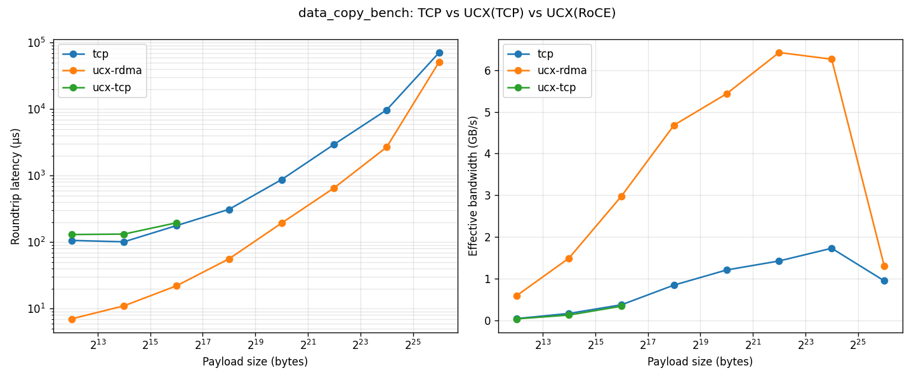

# RDMA Latency vs Payload Size — Why It Scales (and Why 64 MiB Is Broken)

> Companion analysis for [`results_20260514_1831.csv`](results_20260514_1831.csv) and [`result_plot.png`](result_plot.png).



RDMA latency **must** scale with size — zero-copy eliminates CPU memcpy and
syscall overhead, but the bytes still have to traverse the wire. The 100 GbE
link is a hard ceiling at ~12.5 GB/s per direction. What we see is mostly
correct physics, with **one genuine anomaly at 64 MiB**.

## Achieved bandwidth from the run (median, RoCE / `rc_verbs`)

| Size   | RTT      | Effective BW (2×size / RTT) | Per-direction | % of 100 GbE line rate          |
| ------ | -------: | --------------------------: | ------------: | ------------------------------- |
| 4 KiB  | 7 µs     | 1.17 GB/s                   | 0.59 GB/s     | 5 % — **latency-bound** (PCIe + NIC posting) |
| 16 KiB | 11 µs    | 2.98 GB/s                   | 1.49 GB/s     | 12 %                            |
| 64 KiB | 21 µs    | 6.2 GB/s                    | 3.1 GB/s      | 25 %                            |
| 256 KiB| 56 µs    | 9.4 GB/s                    | 4.7 GB/s      | 38 %                            |
| 1 MiB  | 192 µs   | 10.9 GB/s                   | 5.5 GB/s      | 44 %                            |
| 4 MiB  | 645 µs   | 13.0 GB/s                   | 6.5 GB/s      | 52 %                            |
| 16 MiB | 2.68 ms  | 12.5 GB/s                   | 6.3 GB/s      | **50 % — saturating**           |
| 64 MiB | 51 ms    | **2.6 GB/s**                | 1.3 GB/s      | **10 % — broken**               |

The shape is exactly right up to 16 MiB: latency-dominated → bandwidth-saturated.
Then 64 MiB falls off a cliff. That part **is** a code/config bug.

### Comparison vs TCP at 16 MiB

| Transport | Median RTT | Speedup vs plain TCP |
| --------- | ---------: | -------------------: |
| Plain TCP | 9.7 ms     | 1.0× (baseline)      |
| UCX/TCP   | (n/a, sweep stopped at 64 KiB) | — |
| UCX/RoCE  | **2.68 ms** | **3.6× faster**     |

## Why 64 MiB is broken

The `send_us` ratio tells the story: at 16 → 64 MiB (4× data) the send time
grows **27×** (1.2 ms → 33 ms). That's not wire-time, that's per-byte CPU work.
Three likely culprits, in order of probability:

### 1. `ulimit -l` (memlock) too small — most likely

UCX needs to **pin** (mlock) the buffer so the NIC can DMA from it. If the
buffer exceeds your memlock limit, UCX silently falls back to **bounce
buffers**: CPU memcpy from your buffer into a small pre-registered staging
region, posted in chunks. That's O(N) CPU work and explains the cliff.

```bash
ulimit -l             # if this prints 64 (KB) instead of "unlimited", that's the bug

# fix temporarily for this shell:
ulimit -l unlimited

# fix system-wide in /etc/security/limits.conf:
#   *  soft  memlock  unlimited
#   *  hard  memlock  unlimited
```

### 2. Buffers aren't pre-registered, so each transfer pays registration cost

The bench allocates `std::vector<char>` once and reuses it. UCX has a
registration cache, but with rendezvous large transfers it may re-register on
each call if the cache evicts. Explicitly pre-registering with `ucp_mem_map`
once, before the loop, removes that path.

### 3. Rendezvous segment / GET size

Once a transfer goes rendezvous (default threshold ~8 KB on `rc_verbs`), UCX
issues RDMA READs/WRITEs in segments. The default segment can be too small for
very large transfers and the NIC pipeline stalls. Try:

```bash
UCX_RNDV_SCHEME=get_zcopy \
UCX_RC_MAX_GET_ZCOPY=4194304 \
UCX_TLS=rc_verbs,tcp UCX_IB_GID_INDEX=1 \
  ./data_copy_bench_ucx client ucx 24.24.24.2 7778 67108864 10
```

## Quick diagnostic command

Run this once — it will tell us conclusively which protocol UCX picked:

```bash
ulimit -l
UCX_LOG_LEVEL=info UCX_PROTO_INFO=y UCX_TLS=rc_verbs,tcp UCX_IB_GID_INDEX=1 \
  ./data_copy_bench_ucx client ucx 24.24.24.2 7778 67108864 2 2>&1 | head -80
```

The `UCX_PROTO_INFO=y` output shows, for each message size, exactly which
protocol UCX picked:

| Tag in output            | Meaning                                  |
| ------------------------ | ---------------------------------------- |
| `rndv/get/zcopy`         | ✅ Pure RDMA READ, zero copy             |
| `rndv/put/zcopy`         | ✅ Pure RDMA WRITE, zero copy            |
| `rndv/rtr/bcopy`         | ⚠️ Rendezvous via bounce buffer (CPU copy) |
| `am_bcopy` / `eager/bcopy` | ❌ Active-message bounce buffer        |

If 64 MiB is going through `bcopy` while 16 MiB went `zcopy`, that confirms
the memlock / fallback hypothesis.

## TL;DR

- Up to 16 MiB the numbers are physically correct — RoCE is hitting ~50 % line
  rate, **3.6× faster than TCP** at the same size.
- The 64 MiB collapse is real and almost certainly **memlock / bounce-buffer
  fallback**. Check `ulimit -l` first; if it's not `unlimited`, that's the fix.
- Latency scaling with size is *expected and correct*; zero-copy reduces the
  **slope** (CPU work per byte → ~0) but cannot eliminate the wire-time term
  `size / bandwidth`.
